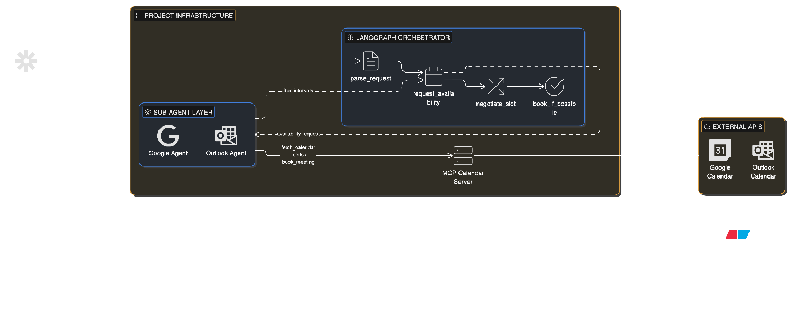
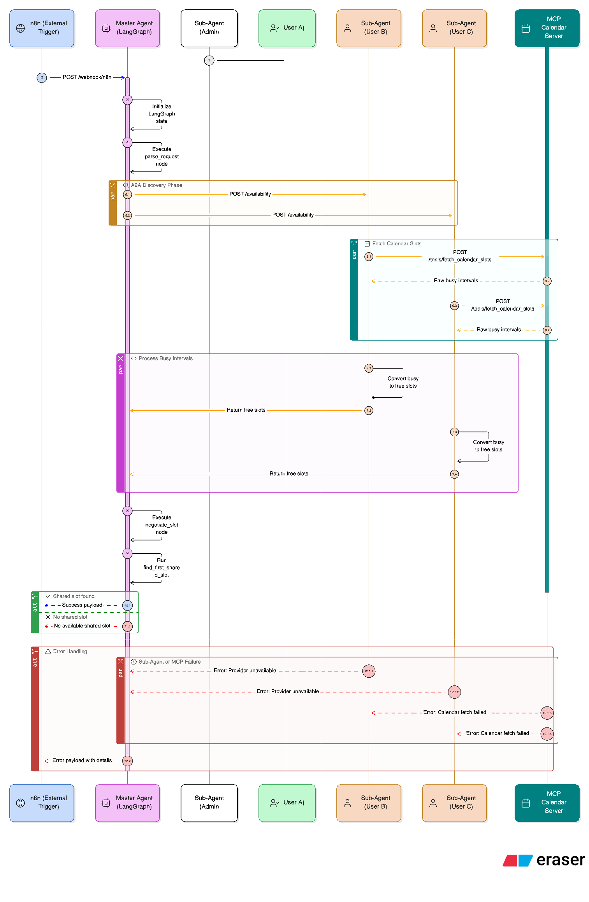

# A2A Calendar Orchestrator (LangGraph + MCP)

Production-grade multi-agent scheduling system that demonstrates Agent-to-Agent (A2A) orchestration with a centralized MCP tool server.

## Abstract

This project solves a real scheduling use case: automatically finding and booking a shared meeting slot for multiple users who may be on different calendar providers (Google and Outlook). It demonstrates A2A protocol by splitting responsibilities across cooperating agents instead of a single monolithic service.

The `master_agent` receives an external trigger (n8n webhook), decomposes the scheduling task, and negotiates with provider-specialized agents (`google_agent_service` and `outlook_agent_service`). Each provider agent independently queries standardized MCP tools, returns structured availability, and participates in a coordinated decision loop. The master then computes the intersection of free slots and delegates final booking through the admin path (user `A`).

This architecture showcases core A2A patterns: task delegation, protocol-based inter-agent messaging, role specialization, traceable negotiation, and centralized tool interoperability via MCP.



## Quick Start

```bash
docker-compose up --build -d --remove-orphans
```

Webhook:

```bash
curl -X POST http://localhost:8010/webhook/n8n \
  -H "Content-Type: application/json" \
  -d '{"trigger":"email","topic":"security","users":["A","B","C"],"providers":{"A":"google","B":"outlook","C":"google"}}'
```

<details>
<summary><strong>Tech Stack And Why It Was Chosen</strong></summary>

1. `Python 3.11+`
Reason: strong async ecosystem, clean service development, and broad AI tooling support.

2. `FastAPI`
Reason: fast API development with typed request/response models, ideal for webhook-driven orchestration.

3. `LangGraph` (with LangChain core)
Reason: explicit state-machine orchestration for multi-step, stateful agent workflows.

4. `LiteLLM` (Claude model interface)
Reason: consistent LLM abstraction layer with model/provider flexibility and easy runtime switching.

5. `MCP-style calendar server`
Reason: standard tool contracts (`fetch_calendar_slots`, `book_meeting`) decouple agents from provider-specific APIs.

6. `Docker Compose`
Reason: reproducible multi-service deployment and local validation of inter-agent networking.

7. `pytest` + `pytest-asyncio`
Reason: deterministic testing of async orchestration paths, including success and no-overlap failure scenarios.

</details>

<details>
<summary><strong>Architecture Overview</strong></summary>

This system has four containerized services:

1. `master_agent`
2. `google_agent_service`
3. `outlook_agent_service`
4. `mcp_calendar_server`

Orchestration path:

1. n8n sends webhook payload to `master_agent`.
2. `master_agent` runs a LangGraph state machine.
3. `master_agent` routes users to provider-specific agents using per-user provider mapping.
4. `google_agent_service` and `outlook_agent_service` call MCP tools on `mcp_calendar_server`.
5. `master_agent` computes the first shared 30-minute slot in the next 7 days with timezone-aware logic.
6. User `A` is admin, so booking is delegated through admin path.
7. `mcp_calendar_server` books and returns confirmation.

Detailed protocol walkthrough: [README-A2A.md](README-A2A.md)



</details>

<details>
<summary><strong>Components In Detail</strong></summary>

### 1. Master Agent (`master_agent`)

Responsibilities:

1. Receive `POST /webhook/n8n`.
2. Execute LangGraph workflow.
3. Coordinate A2A with provider agents.
4. Negotiate shared slot.
5. Trigger booking via admin user `A`.

LangGraph nodes:

1. `parse_request`
2. `request_availability`
3. `negotiate_slot`
4. `book_if_possible`

Key files:

1. `master_agent/app/main.py`
2. `master_agent/app/graph.py`
3. `master_agent/app/scheduler.py`
4. `master_agent/app/clients.py`

### 2. Provider Agent Services (`google_agent_service`, `outlook_agent_service`)

Responsibilities:

1. Independent A2A agents by provider.
2. `google_agent_service` handles Google users.
3. `outlook_agent_service` handles Outlook users.
4. Fetch busy slots from MCP.
5. Convert busy -> free intervals.
6. Enforce booking control (`requested_by="A"`).
7. Enforce provider guardrails.

Endpoints:

1. `POST /availability`
2. `POST /book`

Key files:

1. `sub_agent_service/app/main.py`
2. `sub_agent_service/app/availability.py`
3. `sub_agent_service/app/mcp_client.py`
4. `sub_agent_service/app/config.py`

### 3. MCP Calendar Server (`mcp_calendar_server`)

Responsibilities:

1. Expose tool contracts.
2. `fetch_calendar_slots(user_id, provider)`
3. `book_meeting(start_time, end_time, attendees)`
4. Support `google` and `outlook` contracts.
5. Run mock mode for local tests.

Endpoints:

1. `GET /tools`
2. `POST /tools/fetch_calendar_slots`
3. `POST /tools/book_meeting`

Key files:

1. `mcp_calendar_server/app/main.py`
2. `mcp_calendar_server/app/tools.py`
3. `mcp_calendar_server/app/providers.py`

### 4. Structured Logging

1. `trace_id` correlation across all services.
2. A2A event trail includes:
3. `master.availability.broadcast`
4. `sub_agent.availability.request`
5. `master.negotiate_slot`
6. `master.booking.completed`
7. `mcp.book_meeting`

</details>

<details>
<summary><strong>Request And Response Contract</strong></summary>

Input webhook JSON:

```json
{
  "trigger": "email",
  "topic": "security",
  "users": ["A", "B", "C"],
  "providers": {
    "A": "google",
    "B": "outlook",
    "C": "google"
  }
}
```

Notes:

1. `providers` is optional.
2. Missing users default to `google` (or LLM-selected default when planner is enabled).

Sample success response:

```json
{
  "trace_id": "uuid",
  "status": "success",
  "proposed_slot": {
    "start_time": "2026-04-05T16:00:00+00:00",
    "end_time": "2026-04-05T16:30:00+00:00"
  },
  "booking_result": {
    "booked": true,
    "meeting_id": "mock-...",
    "provider": "mock",
    "start_time": "2026-04-05T16:00:00Z",
    "end_time": "2026-04-05T16:30:00Z",
    "attendees": ["A", "B", "C"]
  }
}
```

</details>

<details>
<summary><strong>Build And Local Run (Python)</strong></summary>

```bash
python3 -m venv .venv
source .venv/bin/activate
pip install -r requirements.txt
pytest -q
```

</details>

<details>
<summary><strong>Docker Deploy</strong></summary>

Start:

```bash
docker-compose up --build -d --remove-orphans
```

Status:

```bash
docker-compose ps
```

Expected services:

1. `master_agent` on `8010 -> 8000`
2. `google_agent_service` on `8001 -> 8001`
3. `outlook_agent_service` on `8003 -> 8001`
4. `mcp_calendar_server` on `8002 -> 8002`

Stop:

```bash
docker-compose down --remove-orphans
```

</details>

<details>
<summary><strong>Test Steps</strong></summary>

1. Start stack:

```bash
docker-compose up --build -d --remove-orphans
```

2. Trigger webhook:

```bash
curl -X POST http://localhost:8010/webhook/n8n \
  -H "Content-Type: application/json" \
  -d '{"trigger":"email","topic":"security","users":["A","B","C"],"providers":{"A":"google","B":"outlook","C":"google"}}'
```

3. Verify:

1. `status` is `success`
2. `proposed_slot` is present
3. `booking_result.booked` is `true`

4. Check logs:

```bash
docker-compose logs -f master_agent google_agent_service outlook_agent_service mcp_calendar_server
```

5. Run automated tests:

```bash
pytest -q
```

Expected: `3 passed`

</details>

<details>
<summary><strong>Environment Variables (.env)</strong></summary>

For mock mode, `.env` is optional because defaults are in `docker-compose.yml`.

Create local env file:

```bash
cp .env.example .env
```

Run using env file:

```bash
docker-compose --env-file .env up --build -d
```

`.env.example` includes:

1. master agent vars
2. google/outlook provider agent vars
3. MCP mock vars
4. production credential placeholders

</details>

<details>
<summary><strong>Troubleshooting</strong></summary>

### Port conflicts

Master is exposed on `8010`, not `8000`.

### Missing/failed service

```bash
docker-compose up --build master_agent
```

### Orphan containers after service rename

```bash
docker-compose down --remove-orphans
docker-compose up --build -d --remove-orphans
```

### Moving from mock to real providers

Replace mock adapters in:

1. `mcp_calendar_server/app/providers.py`

Then wire provider-specific API credentials from `.env`.

</details>

<details>
<summary><strong>Future Enhancements</strong></summary>

1. `Production Calendar Adapters`
Transition from `MockCalendarBackend` to full OAuth2-based integrations with Google Calendar API and Microsoft Graph API.

2. `Dynamic Meeting Parameters`
Update the n8n webhook and Master Agent to support variable meeting durations and custom search horizons beyond the current 30-minute/7-day defaults.

3. `Human-in-the-Loop (HITL) Negotiation`
Implement a multi-slot proposal system where the agent suggests the top 3 windows and waits for admin approval via Slack or email before booking.

4. `Enhanced User Preferences`
Incorporate per-user "Working Hours," "Focus Time" guardrails, and "Preferred Meeting Windows" into the `busy_to_free` logic to prevent scheduling during personal time.

5. `Advanced Observability`
Integrate LangSmith or OpenTelemetry for deep tracing of the LangGraph state machine, allowing for performance monitoring of the A2A negotiation phase.

6. `Conflict Resolution Policies`
Add logic to handle "Soft Conflicts" (e.g., low-priority meetings that can be moved) vs. "Hard Conflicts" to increase the probability of finding a shared slot.

</details>
